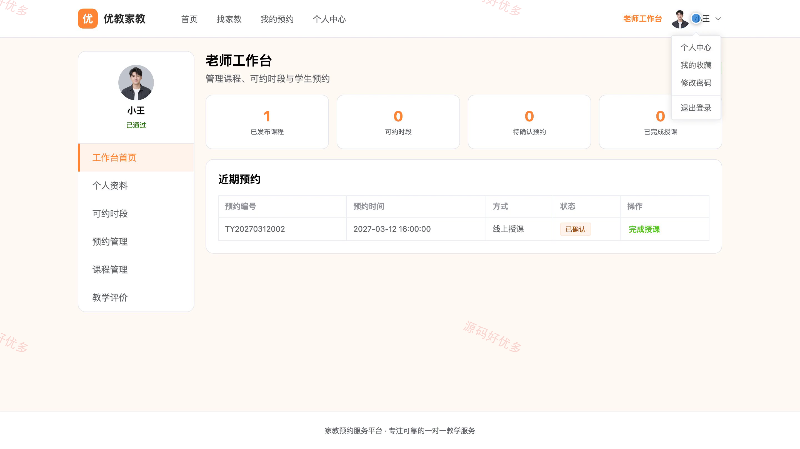
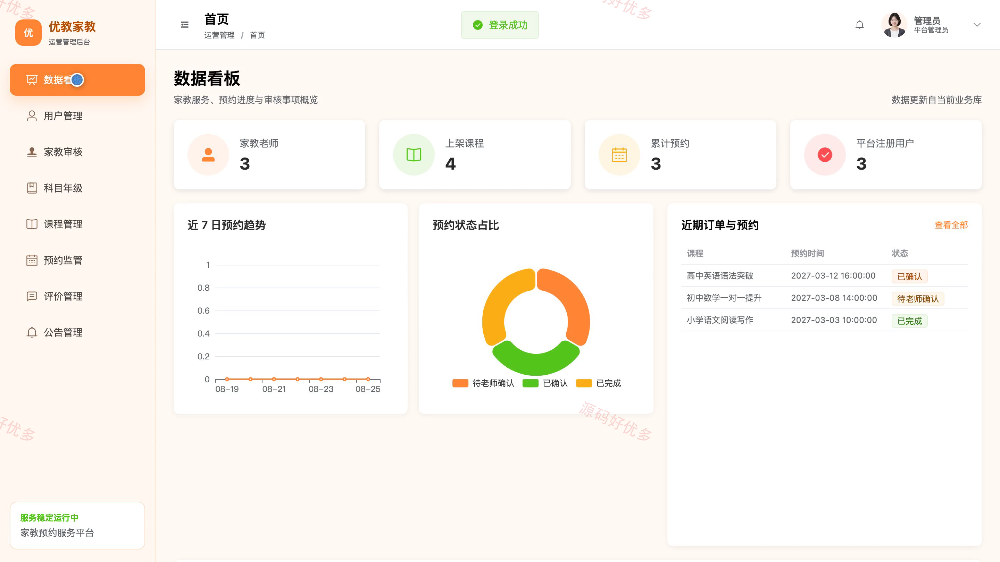
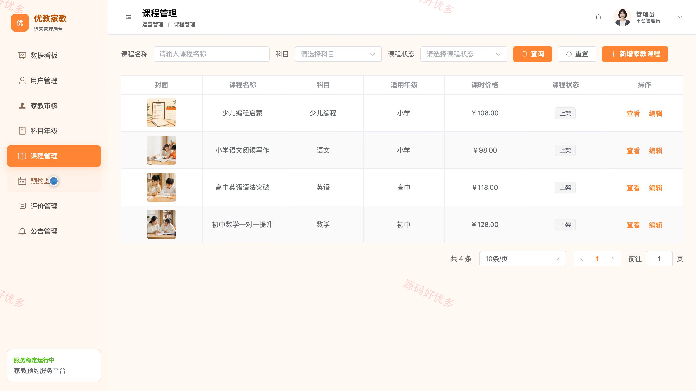

## 源码问题查看主页咨询

### 一、关键词
家教预约、家教平台、一对一辅导、找家教、课程预约

### 二、作品包含
源码+数据库+万字设计文档+PPT+全套环境和工具资源+本地部署教程

### 三、项目技术
前端技术： Html、Css、Js、Vue3.4、Element-Plus
后端技术：Java、SpringBoot3.2.0、MyBatis-Plus

### 四、运行环境（以下版本亲测，其他版本兼容性请自行测试）
开发工具：IDEA/eclipse + VSCODE

数据库：MySQL5.7+（共14张表）

数据库管理工具：Navicat10以上版本

环境配置软件： JDK17 + Maven

前端Nodejs：16+

浏览器：谷歌浏览器

### 五、项目介绍
项目编号：bs070A

家教预约服务平台面向管理员、学生、家教老师，提供项目核心业务等功能，实现各角色在系统中的实际业务协作。

角色：学生、家教老师、管理员

学生功能：注册登录、家教筛选、家教详情、家教收藏、提交预约、预约管理、课后评价、个人资料。

家教老师功能：注册入驻、家教资料维护、可约时段管理、预约处理、授课记录填写、课程管理、评价查看、工作台。

管理员功能：用户管理、家教审核、科目年级维护、课程管理、预约监管、评价管理、公告管理、数据统计。

### 六、运行截图

